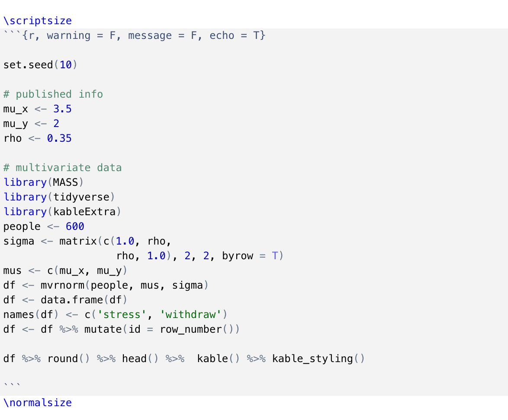

```{r setup, include=FALSE}
knitr::opts_chunk$set(echo = TRUE, warning = F, message = F)

```

Use latex commands before and after code chunks to reduce syntax text size. 

Here is an example...




Bo$^2$m =)